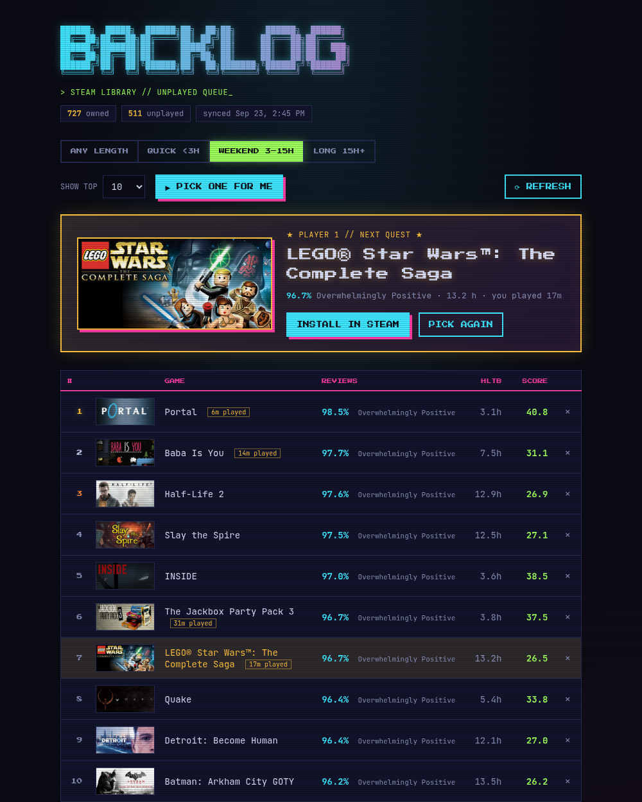

# Steam Backlog

A small self-hosted web app that answers "what should I play next?" from your
Steam library. It ranks your unplayed games by Steam review score and
[HowLongToBeat](https://howlongtobeat.com) length, so short, great games
float to the top, and it can pick one for you.



## Features

- **Ranked backlog** of every unplayed (or barely played) game in your library,
  scored by review % and estimated length.
- **Length toggle**: Any length / Quick (<3h) / Weekend (3–15h) / Long (15h+).
- **Pick one for me**: a weighted random pick from your top N, with a
  one-click Steam install link.
- **Filters out non-games** automatically: tools (Utilities and other software
  genres), betas, playtests, test servers and demos.
- **Category filters** (e.g. hide `VR` or `Online PvP` games) and a per-game
  hide button, both undoable.
- **"Barely played" counts as unplayed**: games you launched once and bounced
  off (under 60 minutes by default, adjustable) stay on the list.
- **Incremental, cached refreshes**: the first run looks up every game and
  takes a while; after that only new games are fetched. Opening the page
  refreshes automatically if the data is more than a day old.

## How ranking works

In **Any length** mode:

```
score = review% ÷ (1 + ln(hours + 1))
```

A 95% game at 2 hours outranks a 95% game at 20 hours, but a great long game
still beats a mediocre short one. Anything under 1 hour is scored as 1 hour so
10-minute party games don't dominate, and games HowLongToBeat couldn't match
get a flat penalty. Inside a length bucket, games are ranked by review %.

Games need at least 50 Steam reviews to be ranked (adjustable in Settings).

## Requirements

- Python 3.11+ (or Docker)
- A [Steam Web API key](https://steamcommunity.com/dev/apikey) (any domain
  name works when registering)
- Your 17-digit Steam ID ([steamidfinder.com](https://www.steamidfinder.com))
- Your Steam profile **and** "Game details" set to **Public** in Steam's
  privacy settings

## Quickstart

```bash
git clone https://github.com/BigMike972/steam-backlog.git
cd steam-backlog
python3 run.py
```

`run.py` creates a virtualenv and installs the requirements the first time
(about a minute), then starts the app. After that it starts instantly. Open
<http://127.0.0.1:5002>, enter your API key and Steam ID, and hit **Refresh**.

- `python3 run.py --port 8080` to use another port
- `python3 run.py --host 0.0.0.0` to reach it from other devices on your
  network (phone, laptop) at `http://<this machine's IP>:5002`

The first refresh looks up reviews, store details and HowLongToBeat times one
game at a time (the APIs are rate-limited), so a library of several hundred
games takes 20–30 minutes. You can close the page while it runs.

Everything is stored in a single SQLite file, `steam_backlog.db`, created
next to `app.py` on first start.

> On Debian, Ubuntu or Raspberry Pi OS, if creating the virtualenv fails,
> install venv support with `sudo apt install python3-venv`.

## Docker

```bash
git clone https://github.com/BigMike972/steam-backlog.git
cd steam-backlog
docker compose up -d
```

(With the older standalone Compose, e.g. Debian's `docker-compose` package,
it's `docker-compose up -d`.)

Then open <http://localhost:5002>. Your settings and cached data live in the
`steam-backlog-data` volume, so they survive rebuilds and upgrades
(`git pull && docker compose up -d --build`). To keep it reachable from the
host machine only, change the port mapping in `compose.yaml` to
`"127.0.0.1:5002:5002"`.

## Running it as a service

`steam-backlog.service` is a systemd unit template for running it without
Docker. Run `python3 run.py` once to set up the virtualenv, fill in your
username and install path in the unit file, then:

```bash
sudo cp steam-backlog.service /etc/systemd/system/
sudo systemctl daemon-reload
sudo systemctl enable --now steam-backlog
```

### Behind nginx on a subpath

The app works under a path prefix like `http://myserver/steam-backlog/`. It
reads nginx's `X-Forwarded-Prefix` header, so nothing needs configuring on
the app side:

```nginx
location = /steam-backlog {
    return 301 /steam-backlog/;
}

location /steam-backlog/ {
    proxy_pass http://127.0.0.1:5002/;
    proxy_set_header Host $host;
    proxy_set_header X-Real-IP $remote_addr;
    proxy_set_header X-Forwarded-For $proxy_add_x_forwarded_for;
    proxy_set_header X-Forwarded-Proto $scheme;
    proxy_set_header X-Forwarded-Prefix /steam-backlog;
}
```

## Command line

```bash
venv/bin/flask --app app refresh          # same as the Refresh button
venv/bin/flask --app app refresh --full   # discard cached data and re-fetch everything
```

## Notes

- **There is no login.** Anyone who can reach the page can see your library
  and change the saved API key. Run it on your home network or behind a VPN,
  not on the open internet.
- **HowLongToBeat has no official API.** Playtimes come from the
  [howlongtobeatpy](https://github.com/ScrappyCocco/HowLongToBeat-PythonAPI)
  library, which reads their website. If their site changes, playtime lookups
  may fail until the library is updated; the app keeps working and retries
  those games on the next refresh.
- Review scores and store details come from Steam's public store endpoints,
  your library from the official Steam Web API.

## License

[MIT](LICENSE)
